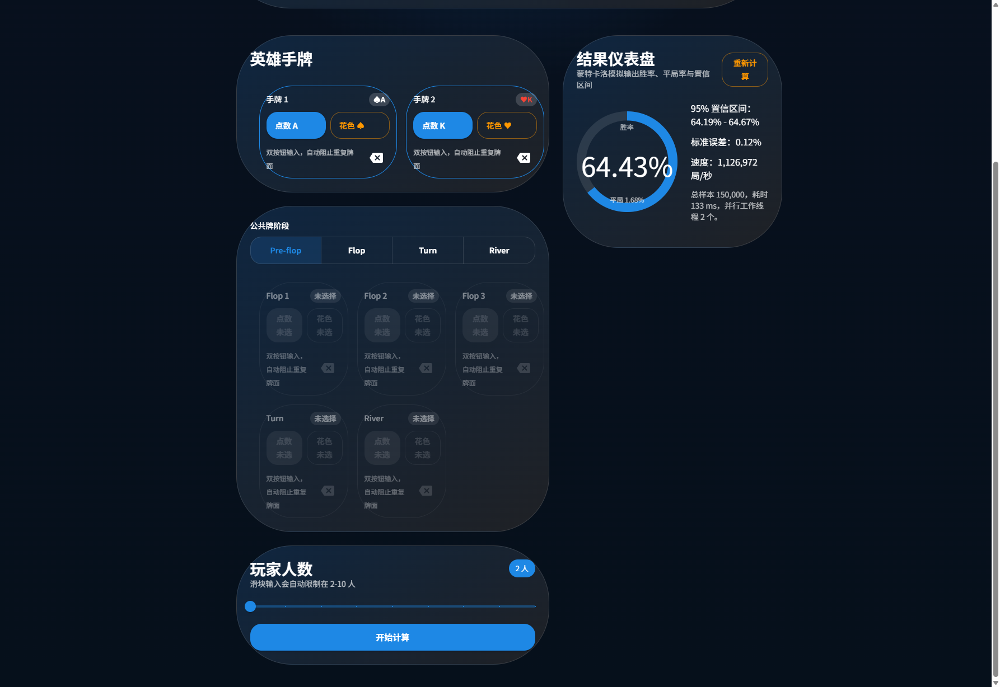

# Holdem Odds Lab

生产级德州扑克胜率计算 Web 应用，面向 Windows 11 + WSL Ubuntu 24 开发环境，基于 React 18、TypeScript 5、Vite、MUI v5、Comlink Web Worker 构建。



## 功能特性

- 双按钮卡片选择器：52 张标准牌输入，自动阻止重复牌并即时反馈
- 公共牌阶段控制：Pre-flop / Flop / Turn / River 动态启用 0-5 张公共牌
- 玩家人数滑块：支持 2-10 人桌，超界自动夹紧并提示
- Worker 并行蒙特卡洛：默认 150,000 次模拟，提供胜率、平局率、标准误差和 95% 置信区间
- 回退机制：Worker 异常时自动切换到主线程单线程计算并提示“性能受限”
- 结果仪表盘：环形进度条、耗时、模拟速度、缓存命中状态和重新计算入口
- 响应式体验：适配 iPhone 15、iPad Pro 与桌面端，按钮最小触控面积 48×48
- 可访问性：合理 Tab 顺序、ARIA 标签、MUI Ripple 反馈、键盘可达

## 技术栈

- React 18 + TypeScript 5 + Vite 5
- MUI v5 + emotion
- react-router-dom 6
- Comlink + TypeScript Web Worker
- Vitest + Testing Library
- ESLint + Prettier + Husky + lint-staged

## 本地安装

### WSL Ubuntu 24

```bash
corepack enable
pnpm install
pnpm dev
```

开发服务器默认地址：

```text
http://localhost:5173
```

更完整的安装说明见 [docs/INSTALL.md](docs/INSTALL.md)。

## 脚本说明

```bash
pnpm dev
pnpm build
pnpm preview
pnpm lint
pnpm test
pnpm format
```

## Docker

构建镜像：

```bash
docker build -t holdem-odds-lab .
```

运行容器：

```bash
docker run --rm -p 8080:80 holdem-odds-lab
```

浏览器访问：

```text
http://localhost:8080
```

## 构建与部署

- `pnpm build` 输出静态资源到 `dist/`
- 已开启 source map，便于生产问题定位
- 静态文件可直接部署到 nginx、GitHub Pages、Vercel
- Docker 生产镜像基于 `nginx:alpine`

## 目录结构

```text
src/
  components/
  lib/
  state/
  test/
  workers/
docs/
  INSTALL.md
  screenshots/
```

## 环境变量

`.env.production` 支持以下变量：

```bash
API_HOST=
```

当前项目纯前端运行，不依赖后端 API，可留空。

## 安全声明

- 纯前端项目，不申请系统级权限
- 不写入本地文件，不调用原生系统 API
- 仅在浏览器内完成概率模拟，对用户设备零侵入

## 许可证

[MIT](LICENSE)
